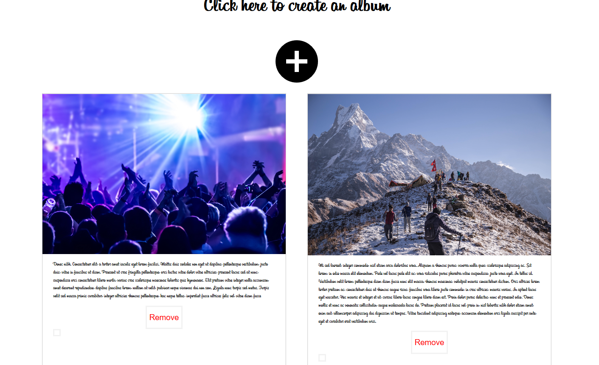

# Assignment 1 - ReactJS app.

Name:  Jeffy Abraham

## Overview.
 A web app which lets you create and manage your own photo album 

## List of user features 
 + Users signup and login
 + Users can add images
 + Users can add descriptions for Images
 + Lets users to comment
 + Can delete the images
 + Can view the images

## Installation requirements.

All the required node modules are saved in package.json, so no seperate installation of modules required. To run the app first start the local JSON server and then start the npm

## Data Model Design.

![][model]

## UI Design.

## Routing.
Public Views

+ / - login page where user can enter their email and password
+ /signup - lets user signup with their email(:id)

Private Views
+ /home-if user is logged in redirect to homepage(Photo gallery)
+ /add-lets user add images with descriptions
+ /pop/:id-display single picture with comments when a pciture is clicked in gallery

## Extra features

+ Use of state management tools(Redux)
+ Use of firebase database to store data
+ Use of firebase for achieving persistence

## Independent learning.

+ Learned firebase authentication https://www.youtube.com/watch?  v=r4EsP6rovwk
+ Learned redux https://www.udemy.com/react-front-to-back/

